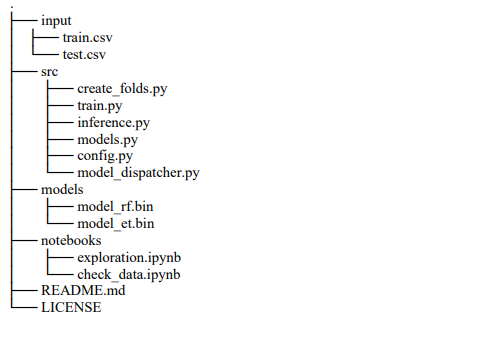

  

# Métodos Avanzados de Análisis de datos II 

## Micro-Proyecto I
Instructor: *Camilo Andres Franco De Los Rios*

1er Micro-proyecto
* Dentro de un modelo de negocio de una start-up agrícola, se pide construir un modelo predictivo de demanda para minimizar el desperdicio alimentario.
* Predicción de demanda de productos agrícolas nativos.
* El enunciado se encuentra en el cuaderno “MicroProyecto1”, y la serie de datos en “DatosAgro.txt”.
* Se debe entregar el cuaderno con el código y un reporte **en formato pdf** en grupos de máximo 3 personas que incluya en máximo 4 paginas, y con secciones separadas:
  * Introduccioncon la definición del problema y la pregunta de investigación (20%)
  * Metodología propuesta (10%)
  * Resultados (20%) y **análisis de los resultados**(25%)
  * Conclusiones (25%)
  * Puede incluir referencias y anexos ademásde las 4 paginas.

## Estructura del repositorio

## Documentación

http://mpastell.com/pweave/examples/index.html

## Notebook
* [MicroProyecto1_StartUp.ipynb](https://nbviewer.jupyter.org/github/sergiomora03/deep-learning-intermediate/blob/master/Micro-Proyecto1_Start-Up%20Agricola/notebooks/MicroProyecto1_StartUp.ipynb)
* [MicroProyecto1_StartUp.html](https://sergiomora03.github.io/deep-learning-intermediate/Micro-Proyecto1_Start-Up%20Agricola/notebooks/MicroProyecto1_StartUp.html)

## Reproducidad

Sí estas usando Linux:
* `sh run.sh`

Sí estas usando Windows:
* `python src/model_dispatcher.py --producto VER0049 --study False`
* `python src/train.py --test 1`
